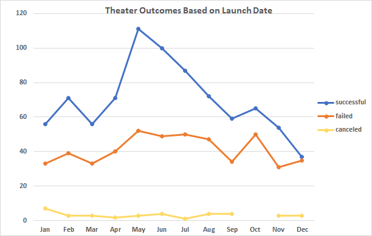
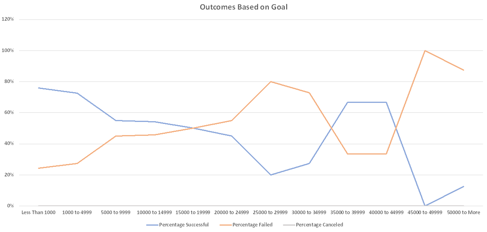

# Kickstarting with Excel

## Overview of Project
To provide an anaylsis breakdown of a dataset on kickstarter campaigns to best understand how Louise's campaign compared to other kickstarter campaigns when looking at their launch dates and their funding goals.

## Purpose
Louise would like to know how different campaigns fared in relation to their launch dates and their funding goals. By doing so, we may be able to create a "formula" for insuring a high chance of success in kickstarter campaigns for the category "Theatre".

## Analysis and Challenges
What you will be seeing in this portion of the report will be some charts and graphs that we have created for you. The charts and graphs you see will help you better understand the information we are trying to convey. We also thought it would be some what of an interest to inform you guys some of the challenges and difficulties we encountered during this little project so you guys can see a glimpse of what all goes on underneath the hood of the mind to making this possible.

### Analysis of Outcomes Based on Launch Date
 What we have here is a chart that shows three different categories of theatre. Successful, failed, and canceled. As we look at the line chart we can see that there is a huge increase of successful theatre campaigns between the months of March and August. In other words - success is much more probable during spring/summer time. We also see a slight increase in failed theatres during those periods but that comes with the nature of there being more attempts in launching a successful theatre. We could discuss the canceled category but it really doesn't offer much input here. Pretty consistent across the board through out the year.

### Analysis of Outcomes Based on Goals
 Our next chart that you're looking at shows us the percentage of canceled, failed, and successful theatres based on what they set their dollar goal amount to.
 The highest chance for success comes in at just under $1000. 76% of campaigns that set their goal to be under $1000 succeeded. As we look further down into the graph you can start to see that once we start setting our goal amount above $5000 and beyond we're dealing with coin tosses; all the way down to a snowball's chance in hell.

### Challenges and Difficulties Encountered
To keep this short and sweet, data can always be broken down even further than what we see here. We could have looked further into why we see a greater chance of success for theatre during the spring and summer; and where the failures are coming from, or even what types of genre are excelling. But, that's not what was asked of us. As an individual who is passionate about his craft, sometimes we need to take a step back and remind ourselves what exactly is it that we're delievering here so that we don't over analyze and miss the goal. 

## Results
Two conclusions on the Outcomes based on Launch Date - 
1st. If you're going to get into theatre, it's best to start your campaign between March and August. 
2nd. Avoid October all together if you dont want to have a "Great" chance of failure.

One conclusion on the Outcomes based on Goals - Set your goal no higher than $4999 if you want have a chance in being part of the "successful" category here.

Some limitations of this dataset can be that it doesn't offer specifics into the country. For example - States, Cities, Counties, etc.

Other tables that can be included are successful/failed theatres during the spring/summer or even the quality of production based on goal amount.
