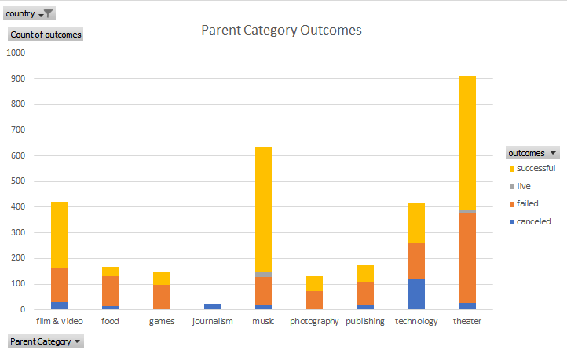
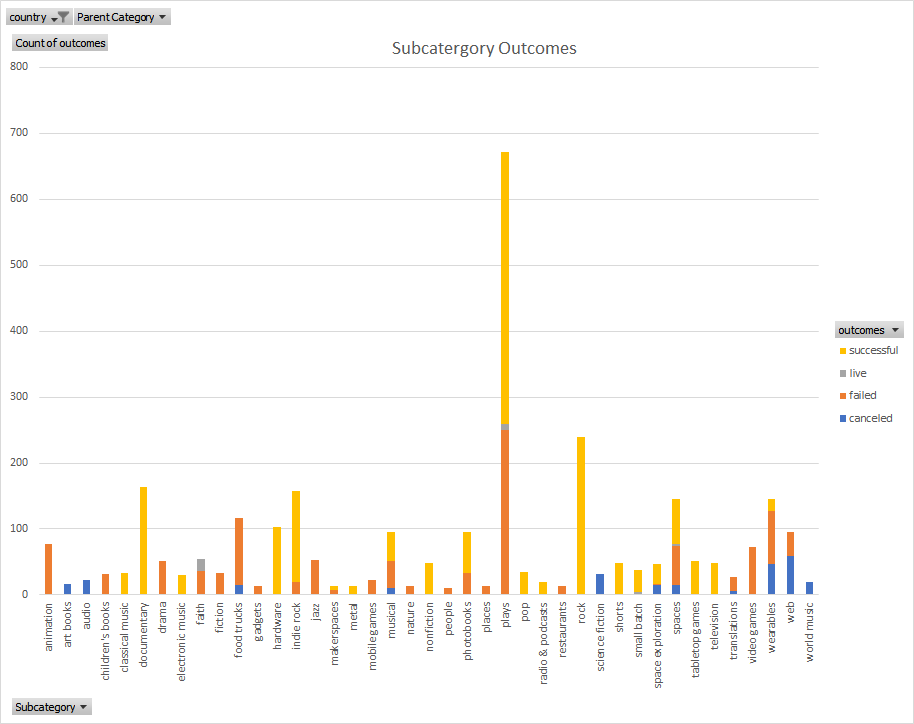

# Kickstarting with Excel

## Overview of Project
To provide an anaylsis breakdown of a dataset on kickstarter campaigns to best understand how Louise's campaign compared to other kickstarter campaigns when looking at their launch dates and their funding goals.

## Purpose
Louise would like to know how different campaigns fared in relation to their launch dates and their funding goals. By doing so, we may be able to create a "formula" for insuring a high chance of success in kickstarter campaigns for the category "Theatre".

## Analysis and Challeneges

### Analysis of Outcomes Based on Launch Date

### Analysis of Outcomes Based of Goals

### Challenges and Difficulties Encountered

## Results

